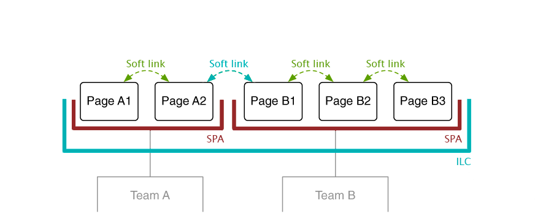

# Introduction

Most JavaScript frameworks come with a dedicated routing solution
like `angular/router` or `vue-router`. They make it possible to
navigate through different pages of an application without having to
do a full page refresh on every link click.
Since we no longer have one monolithic application that handles all routes, instead we have several independent applications, we need to solve an important issue, namely routing.

The following describes how this is handled in the ILC, but first let's dive a little into the general theory of the micro frontend routing and clear up the terminology:

 - Hard navigation describes a page transition where the browser
 loads the complete HTML for the next page from the server.

 - Soft navigation refers to a page transition that’s entirely clientside rendered, typically by using a client-side router. In this
 scenario the client fetches its data via an API from the server.

 So, we have several approaches to implement navigation, the image below shows two of them:

  1.  Page transitions happen via plain links, which result in a full refresh of the page. Nothing special is needed - Team A must know how to link to the pages of Team B and vice versa.
  2. All transitions inside team boundaries are soft. Hard navigation happens when the user crosses team boundaries. From an architectural perspective, it’s identical to the first approach. The fact that a team uses a SPA for its pages is an implementation detail. As long as it responds correctly to URLs, the other team doesn’t have to care.

 

At ILC, we use a third approach called Unified SPA*.
ILC will appear in it as an application shell, it's job is to map URLs to the correct team.

 * The Unified SPA (Single Page Application) approach introduces a central application container. It handles page transitions between the teams. Here all navigations are soft.

 

Now more detail about ILC:

 In ILC, we can use one HTML template for all of our applications. With this approach, SSR occurs once when the page is first loaded, then all navigation occurs through CSR. In addition to the fact that all navigation inside the ILC is soft, it also uses "2-tiered routing".
 The app shell looks at the first part of the URL to determine which team is responsible (top-level routing). The router of the matched team processes the complete URL to find the correct page inside its single-page application (second-level routing).

 - top-level routing - A transition handled by ILC routing, with such a transition, the application on the page changes to another one.

 - second-level routing -  A transition handled by own routing of some application at the page, with such a transition, only the content inside the application changes.

 Transition between applications (top-level routing) in ILC occurs thanks to the `<a>` tags. To do this, ILC keeps track of all `<a>` tags on the page and handles clicking on them, provided that:
 1. tag contains non-empty `href`.
 2. `event.PreventDefault` not equal `false`
 3. `target` not equal `_self`
 4. This is not a special url (`mailto`, `tel`, etc.)
 